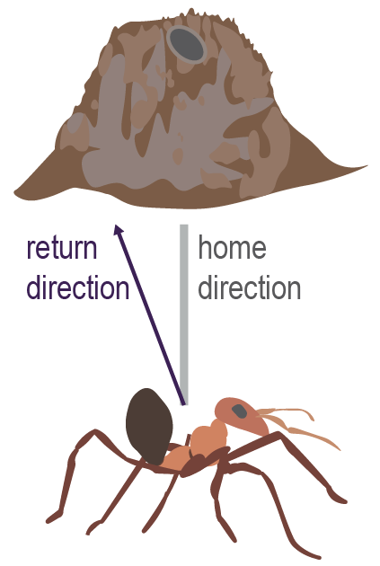
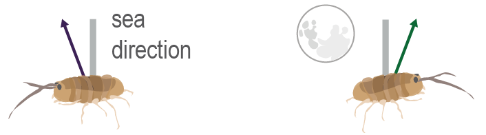

```{r setup, include=FALSE}
knitr::opts_chunk$set(echo = TRUE)
```

# Details

**DESCRIPTION**

Examination of different dataset structures that may arise in the study of animal navigation.

**INPUTS**

`unwrap_functions.R`

**OUTPUTS**

Plotted results.

**REFERENCES**

**data types (inspired by)**

Duelli P & Wehner R (1973) The Spectral Sensitivity of Polarized Light Orientation in Cataglyphis bicolor (Formicidae , Hymenoptera ) *Journal of Comparative Physiology* 53(3) 37-53

Papi F & Pardi L (1963).
On the Lunar Orientation of Sandhoppers (Amphipoda Talitridae).
*Biol. Bull.* 124, 97–105.
<https://doi.org/10.2307/1539571>.

Edrich W, Neumeyer C & von Helversen, O.
(1979) “Anti-sun orientation” of bees with regard to a field of ultraviolet light.
*J. Comp. Physiol.* 134, 151–157.

Dreyer D, Frost B, Mouritsen H, Günther A, Green K, Whitehouse M, Johnsen S, Heinze S & Warrant E (2018) The Earth’s Magnetic Field and Visual Landmarks Steer Migratory Flight Behavior in the Nocturnal Australian Bogong Moth.
*Current Biology* *28*, 2160-2166.e5.
<https://doi.org/10.1016/j.cub.2018.05.030>.

Baird E, Byrne MJ, Scholtz CH, Warrant E, Dacke M (2010) Bearing selection in ball-rolling dung beetles: is it constant?
*Journal of Comparative Physiology A* 196:801–6.
<https://doi.org/10.1007/s00359-010-0559-8>

Giraldo YM, Leitch KJ, Ros IG, Warren TL, Weir PT & Dickinson M H (2018).
Sun Navigation Requires Compass Neurons in Drosophila.
*Current Biology* 28, 2845-2852.e4.

Kishkinev D, Packmor F, Zechmeister T, Winkler H-C, Chernetsov N, Mouritsen H & Holland RA (2021) Navigation by extrapolation of geomagnetic cues in a migratory songbird.
*Current Biology* 12(31) 7, 1563-1569.e4 <https://doi.org/10.1016/j.cub.2021.01.051>

**modelling methods**

Sayin S, Couzin-Fuchs E, Petelski I, Günzel Y, Salahshour M, Lee CY, Graving JM, Li L, Deussen O, Sword GA, et al. (2025) The behavioral mechanisms governing collective motion in swarming locusts.
*Science* 387(6737):995–791

Gabry J, Češnovar R, Johnson A (2022).
cmdstanr: R Interface to 'CmdStan'.
<https://mc-stan.org/cmdstanr/>

Bürkner, P.-C.
(2018).
Advanced Bayesian Multilevel Modeling with the R Package brms.
*The R Journal* 10, 395–411.

Carpenter, B., Gelman, A., Hoffman, M. D., Lee, D., Goodrich, B., Betancourt, M., Brubaker, M., Guo, J., Li, P. and Riddell, A.
(2017).
Stan: A Probabilistic Programming Language.
*Journal of Statistical Software* 76 doi: 10.18637/jss.v076.i01

Vehtari, A., Gelman, A., and Gabry, J.
(2017) Practical Bayesian model evaluation using leave-one-out cross-validation and WAIC.
*Statistics and Computing* 27(5), 1413–1432.
<doi:10.1007/s11222-016-9696-4>.

Paananen, T., Piironen, J., Buerkner, P.-C., Vehtari, A.
(2021).
Implicitly adaptive importance sampling.
*Statistics and Computing* 31, 16.
<doi:10.1007/s11222-020-09982-2>.

# Motivation

These simulated circular datasets provide examples of effects on mean direction, concentration, and individual differences.
Fitted circular models are used to estimate these effects and compare hypotheses about their causes.

# Set up workspace

Before generating these examples, we need to load the appropriate functions.
Make sure that the `circular`, `cmdstanr` and `brms` are installed, and (on Windows) that you have installed the latest version of [Rtools](https://cran.r-project.org/bin/windows/Rtools/).

```{r Load functions and packages}
source('unwrap_functions.R')
```

Set up some colours for plotting.

```{r Set up plot colours}
col_kappa = '#1E78B5'#colour for kappa parameter
col_rho = '#F08024' #colour for mean vector length
col_sd = '#E74A29' #colour for SD and mean angle
col_sd2 = '#E57461' #colour for other SD heuristics
col_pdf = adjustcolor(col = '#21A885', # colour for probability density
                      alpha.f = 0.7)
col_obs = '#3E1F51' #colour for control observations
col_treat = '#006400' # colour for treatment observations
```

# Divergence from home direction




In navigation experiments, return directions are often compared with the expected home direction to determine whether homeward navigation is perturbed.
Here, we simulate example data (𝑛 = 20) generated from a distribution with a mean that differs from the expected direction (0°) by only 15°.

```{r Generate diverging data}
ndata = 20 #sample size

# circular zero expected angle
c0 = circular(x = 0,
              units = 'degrees',
              rotation = 'clock',
              zero = pi/2)
#true mean angle
c15 = circular(x = -15,
              units = 'degrees',
              rotation = 'clock',
              zero = pi/2)

par(pty = 's') # square axes
par(mar = c(0,0,0,0)) # no margins

cd_divergence = DescriptCplot(m = -15, # population mean
                              k = 10, # high concentration
                              refline = 0, # expected direction
                              ndata = ndata,
                              mvcol = col_obs, #distr. mean same colour as observations
                              sdcol = NA, # don't plot SD
                              denscol = NA, # don't plot prob. density
                              save_sample = TRUE)
```

A common short-cut to assess orientation in an expected direction is to use the v-test modification of the Rayleigh test for uniformity.
This tests the hypothesis of uniformity against the alternative of clustering in some direction less than 90° from the expected direction.
The data are very far from uniform ($\kappa = 10$), and the mean angle is very close to the expected angle (cosine similarity of `cos(rad(-15)) = 97%`), so the test is significant.
Even so, the data show a trend away from the expected angle, 75% of points falling to the left of 0°.

```{r v-test for uniformity}
mean(cd_divergence < 0)#proportion left of 0°
rayleigh.test(cd_divergence, mu = c0)#v-test with 0° expected direction

```

We can gain more information about any potential differences between the mean direction and the expected angle by fitting a circular generalised linear model (GLM) that estimates the mean direction ($\mu$) for this dataset.

## Fit the model

In order to fit a circular model using the circular modulo and softplus links, we need to define a custom family.
This family requires two `Stan` functions.
One executes the circular modulo transform and the other uses this transform on estimates of $\mu$ before calculating the log-probability of data $y$ using the von Mises log-probability-density function (LPDF).
This function will be called whenever the family is used, or the prior for a variable is set to `unwrap_von_mises`.
Since this applies the circular modulo link function, so we set the link function for $\mu$ to "identity", and the link function for $\kappa$ to "softplus" ($\log(\exp(x)+1))$), which ensures estimates of $\kappa$ remain strictly positive.

```{r Set up the circular model custom family}
#set up required Stan functions
#circular modulo in Stan code
modulo_circular_fun = stanvar(scode = "
  real modulo_circular(real y) {
    return fmod(y + pi(), 2*pi()) - pi();
  }
",
                           block = 'functions')

#custom likelihood function using the shifted modulo link
stan_unwrap_fun = stanvar(scode = "
  real unwrap_von_mises_lpdf(real y, real mu, real kappa) {
    return von_mises_lpdf(y | modulo_circular(mu), kappa);
  }
  real unwrap_von_mises_rng(real mu, real kappa) {
    return von_mises_rng( modulo_circular(mu) , kappa);
  }
",
                          block = 'functions') 
#define the custom family
unwrap_von_mises = custom_family(
  name = "unwrap_von_mises",
  dpars = c("mu",
            "kappa"),
  links = c('identity',#N.B. the link function is defined via the LPD function
            "softplus"), 
  lb = c(-pi,#lower bound of mu should be -pi
         0),
  ub = c(pi,#upper bound of mu should be pi
         NA),
  type = "real",#takes continuous response data
)

```

To fit our model, we need to convert our data from degrees to radians.
It is also recommended to remove additional formatting by converting from class "circular" to class "numeric".
Our formula indicates that each of $\mu$ and $\kappa$ require a single parameter estimate (`~1`).
In this data, we expect a mean direction anywhere on the circle (within $\pi$ of the mean) and high concentration ($\kappa>1$), so highest prior density is set in that range.

```{r Fit a model to the divergence data}
#reformat data for BRMS
dt_divergence = data.frame(y = as.numeric(#remove circular formatting
                                rad(cd_divergence)#convert to radians
                                )
                           )#make a data frame

#formula for a circular model with no predictors
form_divergence = bf(y~1,
                     kappa~1,
                     family = unwrap_von_mises)
#unbiased priors
prior_divergence =  prior('normal(0,2*pi())', class = 'Intercept', dpar = 'mu') +
                     prior('normal(3,3)', class = 'Intercept', dpar = 'kappa')

#fit a generic unwrap model
model_divergence = brm(formula = form_divergence,
             data = dt_divergence,
             family = unwrap_von_mises,
             stanvars = stan_unwrap_fun + modulo_circular_fun,
             prior = prior_divergence,
             silent = 2,
             backend = 'cmdstan'#faster and more reliable
  )

summary(model_divergence)
```

Since the mean direction is far from the wrap-point ($-\pi$ or $\pi$), the `Rhat` convergence heuristic for the $\mu$ `Intercept` can be interpreted on the linear scale.
`Rhat` values for both parameters are $<1.01$ and effective sample size (ESS) indicates most of the 4000 draws (estimates) explored the posterior distribution efficiently, so we can assume that this model has converged.

To inspect the model's predictions, we can extract the post-warmup draws from the model and plot the posterior distribution of estimates alongside the original data.
Since we simulated the data, we can also compare the model estimates with the true parameters (a luxury we do not have for genuine datasets).
$\mu$ `Intercept` can be plotted as an angle in radians on its original scale.
For $\kappa$, we need to convert estimates to the correct scale using the `softplus` transform, and then calculate its mean-vector-length equivalent using the `A1` function.
There are `4000` posterior estimates, so rather than plotting all of them we'll summarise them as the medians of $\mu$ and $\kappa$ estimates and the normalised 2D kernel density (red and yellow shaded region) of their mean-vector equivalent.

```{r Plot the model fitted for divergence data}
#extract all "draws" of the posterior as a data.frame
draws_divergence = as_draws_df(model_divergence)

#open the plot with two panels
par(pty = 's')
par(mar = c(0,0,0,0),
    mfrow = c(1,2))
#plot the raw data
PCfun(cd_divergence,
      col = col_obs,
      sep = 0.05,
      shrink = 1.25,
      plot_rho = FALSE)
#plot the estimate density
Draws2Cont(draws_divergence,
           x_string = )
#add the mean vector of the distribution used to simulate the data
arrows.circular(x = circular(-15,
                             units = 'degrees',
                             rotation = 'clock',
                             zero = pi/2),
                y = A1(10),
                col = col_obs,
                lwd = 5,
                length = 0.1/1.25
)

#add the median mean-vector estimate
with(draws_divergence,
     arrows.circular(x = median.circular(x =
                                           circular(Intercept,
                                  rotation = 'clock',
                                  zero = pi/2)
                                  ),
                     y = A1(softplus(x = median(x = Intercept_kappa))),
                     lwd = 2,
                     length = 0.1/1.25,
                     col = adjustcolor(col_sd, alpha.f = 200/255))
)

#calculate the misaligned posterior density 
with(draws_divergence,
     {
       paste0('mu left of expected angle: ',
              mean(Intercept < 0)*100, '%')
      }
     ) #nearly all estimates suggest a leftwards turn
#add a histogram of estimates for mu-intercept
with(draws_divergence,
     {
      VertHist(data = deg(Intercept), 
               main = '\nmean angle',
               ylim = c(-30, 15),
               col = adjustcolor(col_sd, alpha.f = 100/255),
               cex.axis = 0.7)
     }
)
#line showing expected direction
abline(h = 0,
       col = 'gray',
       lwd = 7)
```

The fitted model indicates that the mean direction is to the left of the expected direction in $>99\%$ of 𝜇 estimates.

## Test the expected angle hypothesis

To test the hypothesis that the true mean direction falls in the expected direction, we can fit another model where this is explicitly stated.
To inform BRMS that we do not want to estimate the mean direction, we use the notation `y~0`, which removes the intercept parameter.
We can now estimate $\kappa$, *assuming* that the mean direction is 0°, using the same prior for $\kappa$ as before.

```{r Model comparison observed vs expected mean direction}


#fit a model with mean at 0
model_expect = brm(formula = bf(y~0,
                              kappa~1),
                data = dt_divergence,
                family = unwrap_von_mises,
                prior = prior_divergence[2,], # just the kappa prior,
                stanvars = stan_unwrap_fun + modulo_circular_fun,
                silent = 2,
                backend = 'cmdstan'
                )

#add Leave-One-Out Cross-Validation
loo_divergence = loo(model_divergence)
loo_expected = loo(model_expect)
loo_compare(loo_divergence, loo_expected)
```

The model for a divergent mean direction has higher expected log predictive density (ELPD) than the model for the expected direction.
This ELPD difference is $>2\times$ larger than its standard error, so we can state with some confidence that the hypothesis of a divergence from the expected direction is more likely than the hypothesis of alignment with the expected direction.

In this case, the expected angle model is straightforward to fit because the expected angle is 0°, which is also the default intercept for a `y~0` (no-intercept) model.
If the expected direction were not 0°, we would need to adjust the data to align the expected angle with the `0` intercept, then fit both models (expected direction and divergent direction) to the adjusted data.
Here is an example with the expected angle at -15°.

```{r Model comparison for expected angle not at 0}
#align the data relative to the expected angle
dt_aligned = within(dt_divergence,
                    {
                    y = y - rad(-15)  #subtract the expected angle
                    }
                    )


#we now place our expected angle at -15°, the true mean
model_true = brm(formula = bf(y ~ 0,
                            kappa~1),
               data = dt_aligned, 
               family = unwrap_von_mises,
               prior = prior_divergence[2,], # just the kappa prior
               stanvars = stan_unwrap_fun + modulo_circular_fun,
               silent = 2,
               backend = 'cmdstan'
)

#this model should be compared with another fitted to the
#_same data_
model_false =  brm(formula = bf(y ~ 1,
                            kappa~1),
               data = dt_aligned, 
               family = unwrap_von_mises,
               prior = prior_divergence, # the kappa and mu priors
               stanvars = stan_unwrap_fun + modulo_circular_fun,
               silent = 2,
               backend = 'cmdstan'
)

#both models converge well with rhats [1.000, 1.002]
sm_truefalse = lapply(list(true = model_true, false = model_false), summary)
#their mu estimates are very close, differing by only 2°, with overlapping CI.
round( deg(
  sm_truefalse$false$fixed['Intercept',
                                    1:4]
  ) )

#add Leave-One-Out Cross-Validation
loo_true = loo(model_true)
loo_false = loo(model_false)
loo_compare(loo_true, loo_false)
```

Now the expected direction model has higher predictive power, even though both find a similar mean direction.
If the divergence model had higher predictive power, but within one standard error of the expected direction model, we could not rule out the possibility that the expected direction is the true direction, though evidence would be weaker.

# Change in direction




If the expected direction is not known, it can be estimated from control data.
This estimate can then be compared with treatment data, to determine whether the treatment alters orientation.
In this example, the treatment induces a rightward turn of 30°, changing $\mu$ from 180° to 210°.
Concentration is intermediate ($\kappa = 3$).
The two simulated distributions have different random number seeds, to avoid producing two identical distributions of angles with a fixed shift.

```{r Simulate a change in direction}
par(pty = 's')
par(mar = c(0,0,0,0))
par(mfrow = c(1,2))

cd_control = DescriptCplot(m = 180,
                     k = 3,
                     ndata = ndata,
                     mvcol = col_obs,
                     sdcol = NA,
                     denscol = NA,
                     refline = c0,
                     save_sample = TRUE,
                     titleline = -1,#needs to be lower when data are South
                     seed = 1539571)#DOI Papi & Pardi

cd_treatment = DescriptCplot(m = 210,
                       k = 3,
                       ndata = ndata,
                       pcol = col_treat,
                       mvcol = col_treat,
                       sdcol = NA,
                       denscol = NA,
                       refline = c0,
                       save_sample = TRUE,
                       titleline = -1,#needs to be lower when data are South
                     seed = 0120810506) #ISBN Batschelet 1981


```

## Fit the model

To model the change in direction, we need to account for potential differences in both direction and concentration between the control and treatment.
We can combine our two sets of angles together into one vector $y$, that is aligned with the vector $x$, which specifies in Boolean logic (yes: $1$, no: $0$) whether the treatment was applied .
*N.B.* For stability, a slightly narrower prior on `Intercept`, $\mathcal{N}(0,3\pi/2)$, is used.
This reduces the region of $50\%$ prior density from [-240°, 240°] to [-180°, 180°].

```{r Fit treatment direction model}
dt_delta = data.frame(y = rad(
                            as.numeric(
                            c(cd_control,
                              cd_treatment)
                            ) ),
                      x = c(rep(0, length(cd_control)),
                            rep(1, length(cd_treatment)))
                      )

#formula for a circular model with predictor x
form_delta = bf(y~x,
                kappa~x,
                family = unwrap_von_mises)

prior_delta = prior('normal(0,3*pi()/2)', class = 'Intercept', dpar = 'mu') +
        prior('normal(0,pi()/2)', class = 'b', dpar = 'mu') +
        prior('normal(3,3)', class = 'Intercept', dpar = 'kappa') +
        prior('normal(0,3)', class = 'b', dpar = 'kappa')


model_delta =  brm(formula = form_delta,
               data = dt_delta, 
               family = unwrap_von_mises,
               prior = prior_delta, # the kappa and mu priors
               stanvars = stan_unwrap_fun + modulo_circular_fun,
               silent = 2,
               backend = 'cmdstan'
)
summary(model_delta)
```

Because the mean direction for the control now falls precisely at the boundary of $(-\pi, \pi)$, estimates for the `Intercept` parameter with equal likelihood could appear in both positive and negative directions.
The same is also possible for the coefficient `b_x` (treatment change in angle).
If we unwrap these estimates, we can confirm that they converged towards the same angle, even if they moved in different directions.

```{r Unwrap the intercept estimates}
plot(model_delta)
#unwrap estimates and convert to degrees
plot(x = model_delta,
     variable = c('Intercept','b_x'),
     transform = unwrap_circular_deg)
#print the rhat for unwrapped estimates
UnwrapRhats(model_delta,
            variable = c('Intercept','b_x'),
            regex = FALSE
            )
```

Now that we have established that the model has converged, we can inspect the model predictions.
To do this we need to apply the model formula to the estimates.
That means that in the control condition we use estimates of `Intercept` ($\mu$) and `Intercept_kappa`, but for the treatment we need `Intercept` + `b_x` (effect of treatment on $\mu$) and `Intercept_kappa` + `b_kappa_x` (effect of treatment on $\kappa$).

```{r Inspect predictions for change in direction}
draws_delta = as_draws_df(model_delta)

par(pty = 's')
par(mar = c(0,0,0,0),
    mfrow = c(1,3))
PCfun(cd_control,
      col = col_obs,
      sep = 0.05,
      shrink = 1.25,
      plot_rho = FALSE)
Draws2Cont(draws_delta,
           x_string = 'sin(Intercept)*A1(softplus(Intercept_kappa))',
           y_string = 'cos(Intercept)*A1(softplus(Intercept_kappa))',
)
arrows.circular(x = circular(180,
                             units = 'degrees',
                             rotation = 'clock',
                             zero = pi/2),
                y = A1(3),
                col = col_obs,
                lwd = 5,
                length = 0.1/1.25
)
with(draws_delta,
     arrows.circular(x = median.circular(x =
                             circular(Intercept,
                                  rotation = 'clock',
                                  zero = pi/2)
                                  ),
                     y = A1(softplus(x = median(x = Intercept_kappa))),
                     lwd = 2,
                     length = 0.1/1.25,
                     col = adjustcolor(col_sd, alpha.f = 200/255))
)

PCfun(cd_treatment,
      col = col_treat,
      sep = 0.05,
      shrink = 1.25,
      plot_rho = FALSE)
Draws2Cont(draws_delta,
           x_string = 'sin(Intercept+b_x)*A1(softplus(Intercept_kappa+b_kappa_x))',
           y_string = 'cos(Intercept+b_x)*A1(softplus(Intercept_kappa+b_kappa_x))',
)
arrows.circular(x = circular(205,
                             units = 'degrees',
                             rotation = 'clock',
                             zero = pi/2),
                y = A1(3),
                col = col_treat,
                lwd = 5,
                length = 0.1/1.25
)
with(draws_delta,
     arrows.circular(x = median.circular(x =
                             circular(Intercept + b_x,
                                  rotation = 'clock',
                                  zero = pi/2)
                                  ),
                     y = A1(softplus(x = median(x = Intercept_kappa +
                                                  b_kappa_x))),
                     lwd = 2,
                     length = 0.1/1.25,
                     col = adjustcolor(col_sd, alpha.f = 200/255))
)
with(draws_delta, paste0(mean(b_x > 0)*100, '%') ) #nearly all estimates suggest a rightwards turn

with(draws_delta, paste0( round(
                        deg(median.circular(x =
                             circular(b_x,
                                  template = 'none')
                                  )
                            ) ), 
                            '°')
     ) #the size recovered is similar to the simulated turn of 210-180
with(draws_delta,
     VertHist(data = Mod360.180(deg(b_x)), 
              main = 'change in mean angle',
              ylim = c(-90, 90),
              col = adjustcolor(col_sd, alpha.f = 100/255),
              axes = F,
              cex.axis = 0.7))
abline(h = 0,
       col = 'gray',
       lwd = 7)
axis(1)
axis(2, at = -6:6*15)

```

Uncertainty in the example data results in a wide range of posterior estimates for the treatment direction.
Nonetheless, $\>95\%$ of estimates for change in 𝜇 are to the right of 0°, suggesting a rightwards change in direction.

## Test the direction change hypothesis

We can investigate this further using model comparison, by fitting models with only treatment effects on $\kappa$, and no effects of treatment on $\mu$ or $\kappa$.
We do this by setting the formula for $\mu$ and $\kappa$ to `~1` (estimate intercept only).

```{r LOO-CV direction change}
#model with effects of treatment on kappa, but not mu
model_kappadelta =  brm(formula = bf(y~1,
                                     kappa~x),
               data = dt_delta, 
               family = unwrap_von_mises,
               prior = prior_delta[c(1,3:4),], # the all kappa & 1st mu prior
               stanvars = stan_unwrap_fun + modulo_circular_fun,
               silent = 2,
               backend = 'cmdstan'
)
#model with no effects of treatment
model_nodelta =  brm(formula = bf(y~1,
                                  kappa~1),
               data = dt_delta, 
               family = unwrap_von_mises,
               prior = prior_delta[c(1,3),], # intercept kappa & mu priors
               stanvars = stan_unwrap_fun + modulo_circular_fun,
               silent = 2,
               backend = 'cmdstan'
)
#all models converge well
print(
  list(`treat. kappa` = 
    summary(model_kappadelta),
    `unwrapped rhat` = 
    UnwrapRhats(model_kappadelta,
                variable = c('Intercept'),
                regex = FALSE
                ),
    `no treat.` = 
    summary(model_nodelta),
    `unwrapped rhat no treat.` = 
    UnwrapRhats(model_nodelta,
                variable = c('Intercept'),
                regex = FALSE
                )
    ),
  digits = 3
)

loo_delta = loo(model_delta)
loo_kappadelta = loo(model_kappadelta)
loo_nodelta = loo(model_nodelta)
print(loo_compare(loo_delta, loo_kappadelta, loo_nodelta))
```

In this case there is uncertainty about the effect of treatment on direction.
Although the model with a change in direction indicates the change to be very consistent (95% CI do not overlap with 0°), these differences could also be explained well by a null model with no change.
Since the median estimate is close to the true value of 30°, the model's estimates appear to be robust, if not conclusive.
Conversely, we can conclude that there was no effect of treatment on concentration, since `model_kappadelta` is a much worse fit than the null model (`model_nodelta`).

# Change in concentration


An experimental treatment may also affect concentration independently of mean direction.
In this example the simulated data for the treatment has exactly the same $\mu$ (0°) as the control, but $\kappa$ decreases by $>80\%$.

```{r Simulate a decrease in concentration}
par(pty = 's')
par(mar = c(0,0,0,0))
par(mfrow = c(1,2))

cd_3 = DescriptCplot(m = 0,
                     k = 3,
                     ndata = ndata,
                     mvcol = col_obs,
                     sdcol = NA,
                     denscol = NA,
                     refline = c0,
                     save_sample = TRUE)
cd_0.5 = DescriptCplot(m = 0,
                       k = 0.5,
                       ndata = 20,
                       pcol = col_treat,
                       mvcol = col_treat,
                       sdcol = NA,
                       denscol = NA,
                       refline = c0,
                       save_sample = TRUE)
```

## Fit the model

By default, the assumptions for this model would be the same as for the change in angle: we want to be able to account for any potential effects of the treatment on both $\mu$ and $\kappa$, even if we suspect that the treatment only affects one parameter.
We can therefore use the same model as for the change in angle.

```{r Fit treatment concentration model}
dt_conc = data.frame(y = rad( as.numeric( c(cd_3, cd_0.5) ) ), 
                      x = c(rep(0, length(cd_3)), rep(1, length(cd_0.5))) )

#formula for a circular model with predictor x
form_conc = bf(y~x,
                kappa~x,
                family = unwrap_von_mises)

prior_conc = prior('normal(0,3*pi()/2)', class = 'Intercept', dpar = 'mu') + 
                prior('normal(0,pi()/2)', class = 'b', dpar = 'mu') + 
                prior('normal(3,3)', class = 'Intercept', dpar = 'kappa') + 
                prior('normal(0,3)', class = 'b', dpar = 'kappa')

model_conc = brm(formula = form_conc, 
                  data = dt_conc,
                  family = unwrap_von_mises,
                  prior = prior_conc, # the kappa and mu priors 
                  stanvars = stan_unwrap_fun + modulo_circular_fun, 
                  silent = 2, backend = 'cmdstan' ) 
summary(model_conc)
```

The model successfully recovers a large change in $\kappa$ caused by the treatment, alongside only a negligible potential change in $\mu$ (approximately equal posterior density either to the left and right of 0°).
Since the model formula is identical to the change in direction example, we can extract the predictions in the same way.

```{r Inspect predictions for change in kappa}

draws_conc = as_draws_df(model_conc)

par(pty = 's')
par(mar = c(0,0,0,0),
    mfrow = c(1,3))
PCfun(cd_3,
      col = col_obs,
      sep = 0.05,
      shrink = 1.25,
      plot_rho = FALSE)
Draws2Cont(draws_conc,
           x_string = 'sin(Intercept)*A1(softplus(Intercept_kappa))',
           y_string = 'cos(Intercept)*A1(softplus(Intercept_kappa))',
)
arrows.circular(x = circular(0,
                             units = 'degrees',
                             rotation = 'clock',
                             zero = pi/2),
                y = A1(3),
                col = col_obs,
                lwd = 5,
                length = 0.1/1.25
)
with(draws_conc,
     arrows.circular(x = median.circular(x =
                             circular(Intercept,
                                  rotation = 'clock',
                                  zero = pi/2)
                                  ),
                     y = A1(softplus(x = median(x = Intercept_kappa))),
                     lwd = 2,
                     length = 0.1/1.25,
                     col = adjustcolor(col_sd, alpha.f = 200/255))
)

PCfun(cd_0.5,
      col = col_treat,
      sep = 0.05,
      shrink = 1.25,
      plot_rho = FALSE)
Draws2Cont(draws_conc,
           x_string = 'sin(Intercept+b_x)*A1(softplus(Intercept_kappa+b_kappa_x))',
           y_string = 'cos(Intercept+b_x)*A1(softplus(Intercept_kappa+b_kappa_x))',
)
arrows.circular(x = circular(0,
                             units = 'degrees',
                             rotation = 'clock',
                             zero = pi/2),
                y = A1(0.5),
                col = col_treat,
                lwd = 5,
                length = 0.1/1.25
)
with(draws_conc,
     arrows.circular(x = median.circular(x =
                             circular(Intercept + b_x,
                                  rotation = 'clock',
                                  zero = pi/2)
                                  ),
                     y = A1(softplus(x = median(x = Intercept_kappa +
                                                  b_kappa_x))),
                     lwd = 2,
                     length = 0.1/1.25,
                     col = adjustcolor(col_sd, alpha.f = 200/255))
)
with(draws_conc, paste0(mean(b_kappa_x < 0)*100, '%') ) #nearly all estimates suggest a reduction in kappa
#calculate contrast on true scale by softplus transforming estimates
with(draws_conc,
     VertHist(data = softplus(Intercept_kappa+b_kappa_x) - softplus(Intercept_kappa), 
              main = '\nchange in kappa',
              ylim = c(-5, 1),
              col = adjustcolor(col_kappa, alpha.f = 100/255),
              axes = FALSE,
              cex.axis = 0.7))
abline(h = 0,
       col = 'gray',
       lwd = 7)
axis(1)
axis(2, at = (-5:1))


```

Although there is some uncertainty in the particular size of the change in $\kappa$, $99\%$ of posterior estimates support a treatment effect that decreases $\kappa$.
*N.B.* Since $\kappa$ is estimated on the inverse-softplus scale, the estimates for the control and treatment need to be calculated and then softplus transformed before a difference in $\kappa$ can be calculated on its true scale.

## Test the concentration change hypothesis

We can investigate this further with model comparison by fitting models with no effects of treatment, and effects on only kappa.
We do this by setting the formula for $\mu$ and $\kappa$ to `~1` (estimate intercept only).

```{r LOO-CV concentration change}
#model with effects of treatment on kappa, but not mu 
model_conc_kappa =  brm(formula = bf(y~1,
                                          kappa~x),                
                             data = dt_conc,                 
                             family = unwrap_von_mises,
                             prior = prior_conc[c(1,3:4),], # the all kappa & 1st mu prior                
                             stanvars = stan_unwrap_fun + modulo_circular_fun,    
                             silent = 2,                
                             backend = 'cmdstan') #model with no effects of treatment 
model_conc_nokappa =  brm(formula = bf(y~1,
                                       kappa~1),
                          data = dt_conc,
                          family = unwrap_von_mises,
                          prior = prior_conc[c(1,3),], # intercept kappa & mu priors                
                          stanvars = stan_unwrap_fun + modulo_circular_fun,                
                          silent = 2,                
                          backend = 'cmdstan' ) 
#all models converge well 
print(   list(`treat. kappa` =      summary(model_conc_kappa),     
              `unwrapped rhat` =
                UnwrapRhats(model_conc_kappa,
                            variable = c('Intercept'),
                            regex = FALSE
                                  ),
              `no treat.` =      summary(model_conc_nokappa),
              `unwrapped rhat no treat.` =
                UnwrapRhats(model_conc_nokappa,
                            variable = c('Intercept'),
                            regex = FALSE
                            )     
              ),   digits = 3 )  
loo_conc = loo(model_conc) 
loo_conc_kappa = loo(model_conc_kappa) 
loo_conc_nokappa = loo(model_conc_nokappa) 
print(loo_compare(loo_conc, loo_conc_kappa, loo_conc_nokappa))
```

In this case the hypothesis tests are clear, the effect of change in kappa (present in both our original model and the kappa only model) improves model predictive density.
As we might have also expected, the effect of treatment on $\mu$, present in our original model but not the $\kappa$-only model, does not improve predictive density, so there is little evidence that the treatment affects $\mu$.

# High inter-individual correlation


In datasets that include repeated measurements across individuals, it is necessary to account for individual differences before attempting to identify any population level trends.
In the simplest case, the orientation behaviour of different individuals is very similar: for example, all individuals may share a common goal direction $\beta_0$, but differ in alignment with that direction by their individual offsets from that direction $\beta_i$.
In this case $\mu$ and $\kappa$ depend on the specific values of $\beta_0$ and $\beta_i$, and the distribution across $\beta_i$ is determined by the hyperparameter $\kappa_\mu$.
In the simplest case, the orientation behaviour of different individuals is very similar.
One example would be where all individuals share a common goal direction $\beta_0$, but differ in alignment with that direction by their individual offsets from that direction $\beta_i$.
In this case $\mu$ and $\kappa$ depend on the specific values of $\beta_0$ and $\beta_i$, and the distribution across $\beta_i$ is determined by the hyperparameter $\kappa_\mu$, the concentration across individual offsets.

In this example, each individual's headings are highly concentrated around their particular directional bias with the distribution $\mu_i = \beta_0 + \beta_i$, $\kappa = 5.0$.
The distribution of individual biases is moderately concentrated, $\kappa_\mu = 2.0$, so that the heading biases of different individuals are quite close together.

```{r Simulate high interindividual correlation}
kappa_mu_highcorr = 2.0 # concentration _across_ individuals
kappa_id_highcorr = 5.0 # concentration _within_ individual

ndata = 10 # moderate sample size
set.seed(0120810506)#ISBN Batschelet, 1981
mu_highcorr = rvonmises(n = 10,
                mu = c0,
                kappa = kappa_mu_highcorr)
print(round(mu_highcorr))

par(pty = 's')
par(mar = c(0,0,0,0))
par(mfrow = c(3,4))
#Loop through individuals generating a random sample for each individual
id_highcorr = mapply(FUN = DescriptCplot,
                m = mu_highcorr, 
                seed = 1000*1:length(mu_highcorr), #different seed for each
                save_sample = TRUE,
                k = kappa_id_highcorr,#all the same concentration
                ndata = 20,
                refline = 0,
                sdcol = NA,
                denscol = NA,
                mvcol = col_obs,
                lwd = 5,
                SIMPLIFY = FALSE
                )
#Add the population of biases
DescriptCplot(k = kappa_mu_highcorr,
              ndata = 10,
              refline = 0,
              sdcol = NA,
              denscol = NA,
              pcol = NA,
              cicol = col_sd,
              mvcol = col_sd
)
points.circular(mu_highcorr,
                bins = 360/5-1,
                stack = TRUE,
                sep = 0.05,
                shrink = 1.25,
                col = col_rho
)
#Show the pooled data across all individuals
dt_comb_highcorr = do.call(what = c,
                   args = id_highcorr)
PCfun(angles = dt_comb_highcorr,
      col = 'gray25',
      shrink = 3.0)
#Fit the maximum likelihood distribution for the pooled data
mle_comb_highcorr = mle.vonmises(x = dt_comb_highcorr,bias = TRUE)
#Plot the estimated mean vector across pooled data
with(mle_comb_highcorr,
     {
       arrows.circular(x = circular(mu,
                                    units = 'degrees',
                                    rotation = 'clock',
                                    zero = pi/2),
                       y = A1(kappa),
                       lwd = 3,
                       col = col_pdf,
                       length = 0.1
       )
     }
)
```

The high correlation is apparent, since the majority of individual heading biases are within 45° of the population mean (orange points).
Each individual's sample is also tightly clustered around its individual mean (blue points).
Pooling data across individuals (grey points), we can see a preponderance of data in the population mean direction, but a much wider spread (lower concentration) than within any one individual's headings.

We can use a hierarchical model, accounting for differences and similarities between individuals, to measure concentration for the average individual ($\alpha_0$) and across individual heading biases ($\kappa_\mu$), as well as to confirm expectations about the population mean direction ($\beta_0$).

## Fit the model

To model this in `BRMS` we can construct a 'nonlinear' formula for predicting the vector of angles $y$ that is comprised of the sum estimates of $\beta_0$ and $\beta_i$.
$\beta_0$ is estimated as an `Intercept` (single estimate across individuals), and $\beta_i$ lacks an intercept (`~0`) but includes a different offset for each individual.

```{r Formula for an individual effects model}
#collect data
dt_highcorr = data.frame(y = as.numeric( rad(unlist(id_highcorr)) ),#angles as a numeric vector in radians
                         ID = factor(x = #individual labels as an unordered categorical (factor)
                                       sort(
                                         rep(1:length(id_highcorr),
                                             times = length(id_highcorr[[1]]))
                                         ),
                                     ordered = FALSE)
                             )
#set up formula with both 'nonlinear' and linear predictors
form_highcorr = bf(y ~ mu,
                  nlf(mu ~ beta0 + betai),#a nonlinear formula
                  beta0 ~ 1,
                  betai ~ 0 + ID,
                  kappa ~ 1 + (1|ID),#a linear formula
                  family = unwrap_von_mises)
```

We can also estimate the concentration across $\beta_i$, by defining the hyperparameter `softkappamu` in `Stan` code, which is the inverse-softplus of estimates for the $\kappa_\mu$ parameter.
This is linked to estimates of $\beta_i$ because its softplus transform (`log1p_exp(softkappamu)`) acts as a prior on the von Mises distribution of $\beta_i$: $\beta_i \sim \mathcal{M}(0,\kappa_\mu)$.
This parameter is not explicitly stated in our model formula, so its prior needs to be added as Stan code, using the `set_prior` function with `check = FALSE` to inform `BRMS` that is does not need to check the prior against the model formula.
Since our $\kappa_\mu$ estimates need to balance similarity between individuals against any identifiable differences (partial pooling) we should set a prior distribution for $\kappa_\mu$ with high prior density towards strong correlation ($10 < \kappa_\mu < 20$) but some density towards lower values.
A log-normal distribution $\log \kappa_\mu \sim \mathcal{N}(\log(15),0.6)$ balances these two objectives.

To include individual differences in $\kappa$ in the model, we can rely on the automatic methods for linear modelling in `BRMS`.
That means that to the formula for population level $\kappa$ (`kappa_Intercept`: `kappa~1`) we add the individual-effects term `+(1|ID)`.
As for $\beta_i$, this implies a set of offsets from the population for each individual ($\alpha_i$) that follow a normal distribution (on the inverse-softplus scale) defined by $\sigma_\kappa$.
As for $\kappa_\mu$ we require a prior that balances correlation and potentially large differences, with high prior density for $\sigma_\kappa \approx 0$ but some density at much larger values.
This can be achieved with a the positive half of a student-T distribution with 3 degrees of freedom, a mean at 0, and a standard deviation of 0.5: $\sigma_\kappa \sim \mathrm{Half}\mathcal{T}(3,0,0.5)$.

To apply our von Mises prior to the vector of $\beta_i$ estimates, we now also need to update our `unwrap_von_mises` function, to include a version for vectors (`unwrap_von_mises_vect`).

```{r Model individuals (high correlation)}

prior_highcorr =  prior('normal(0,3*pi()/2)', class = 'b', nlpar = 'beta0') +
                  prior('unwrap_von_mises_vect(0, log1p_exp(softkappamu))',
                        nlpar  = 'betai',  class = 'b') +
                  set_prior("target += lognormal_lpdf(log1p_exp(softkappamu) | log(15), 0.6)", #expect high concentration (low variation) 
                            check = FALSE) +
                  prior('normal(3,3)', class = 'Intercept', dpar = 'kappa') +
                  prior('student_t(3, 0, 0.5)', class = 'sd', dpar = 'kappa')

#Introduce stan variable for kappamu
stan_softkappamu = stanvar(scode = "
real softkappamu;
                           ",
                           block = "parameters") + 
  stanvar(scode = "
real kappa_mu = log1p_exp(softkappamu);
          ", 
          block = 'genquant')

#update the unwrap function to account for vectors
stan_unwrap_fun = stanvar(scode = "
    real unwrap_von_mises_lpdf(real y, real mu, real kappa) {
      return von_mises_lpdf(y | modulo_circular(mu), kappa);
    }
    real unwrap_von_mises_rng(real mu, real kappa) {
      return von_mises_rng( modulo_circular(mu) , kappa);
    }
    real unwrap_von_mises_vect_lpdf(vector y, real mu, real kappa) {
    real tmp = 0;
    for(i in 1:size(y))
    {
    tmp = tmp + unwrap_von_mises_lpdf(y[i] | mu, kappa);
    }
      return tmp;
    }
  ",
                          block = 'functions')


#run the model
model_highcorr = brm(
          formula = form_highcorr,
           data = dt_highcorr,
           family = unwrap_von_mises,
           stanvars = stan_unwrap_fun + 
                      modulo_circular_fun + 
                      stan_softkappamu,
           prior = prior_highcorr,
          cores = 4,
          silent = 2,
          backend = 'cmdstan') 
```

As for the previous models, for some of the circular variables estimates from different chains are separated (for individuals 7, 8 and 10), which can make it appear that the model has not converged.
Each $\beta_i$ estimate behaves in this way, and needs to be unwrapped before we can determine whether the chains have arrived at similar estimates.

```{r Unwrap individual biases}
#not all raw estimates look like they have converged
plot(model_highcorr,
      ask = FALSE,
      variable = 'betai',
      regex = TRUE) #plot raw estimates
#but they overlap when unwrapped
plot(x = model_highcorr,
     variable = c('betai'),
     regex = TRUE,
     ask = FALSE,
     transform = unwrap_circular_deg) 

```

Calculating the $\hat{R}$ values for unwrapped estimates for $\beta_i$ reveals that all estimates converged well ( $\hat{R}<1.01$).

```{r Inspect the high correlation individuals model}

sm_highcorr = summary(model_highcorr)
print(sm_highcorr, digits = 2)
#beta0 and betai look bad, but good after unwrapping
UnwrapRhats(model_highcorr,
            variable = '^b_beta0')
UnwrapRhats(model_highcorr,
            variable = '^b_betai')
```

The estimates of $\kappa_\mu$ here have a slight positive bias, due to a combination of low sample size and our prior to higher values.
The model nonetheless recovers good estimates of $\beta_0$ and $\beta_i$.
Importantly, this also allows us to estimate population $\kappa$, that is the concentration of the average individual, which needs to be distinguished from individual differences and the concentration across individuals.

```{r Plot the high correlation individuals model}

draws_highcorr = as_draws_df(model_highcorr)

par(pty = 's')
par(mar = c(0,0,0,0),
    mfrow = c(3,4))
for(i in 1:length(id_highcorr) )
{
  mu_name = paste0('b_betai_ID',i)
  kappa_name = paste0('r_ID__kappa[',i,',Intercept]')
  PCfun(id_highcorr[[i]],
        col = col_obs,
        sep = 0.05,
        shrink = 1.25,
        plot_rho = FALSE)
  arrows.circular(x = mu_highcorr[i],
                  y = A1(kappa_id_highcorr),
                  col = col_obs,
                  lwd = 5,
                  length = 0.1/1.25
  )
  Draws2Cont(draws_highcorr,
             x_string = 'sin(b_beta0_Intercept + get(mu_name))*
                         A1(softplus(Intercept_kappa+get(kappa_name)))',
             y_string = 'cos(b_beta0_Intercept + get(mu_name))*
                         A1(softplus(Intercept_kappa+get(kappa_name)))'
             )
  with(draws_highcorr,
       arrows.circular(x = median.circular(
                             circular(x = 
                             mod_circular(b_beta0_Intercept + get(mu_name)),
                                                    units = 'radians',
                                                    rotation = 'clock',
                                                    zero = pi/2)
                                           )[1],
                       y = A1(softplus(median(Intercept_kappa+get(kappa_name)))),
                       lwd = 2,
                       length = 0.1/1.25,
                       col = adjustcolor(col_sd, alpha.f = 200/255))
  )
}

#Add the population of biases
DescriptCplot(k = kappa_mu_highcorr,
              ndata = 10,
              refline = 0,
              sdcol = NA,
              denscol = NA,
              pcol = NA,
              cicol = NA,
              mvcol = col_rho
)
points.circular(mu_highcorr,
                bins = 360/5-1,
                stack = TRUE,
                sep = 0.05,
                shrink = 1.25,
                col = col_rho
)
Draws2Cont(draws = draws_highcorr,
           x_string = 'sin(b_beta0_Intercept)*
             A1(softplus(kappa_mu))',
           y_string = 'cos(b_beta0_Intercept)*
             A1(softplus(kappa_mu))'
           )

with(draws_highcorr,
     arrows.circular(x = mean.circular(circular(b_beta0_Intercept,
                                                  units = 'radians',
                                                  rotation = 'clock',
                                                  zero = pi/2)
     )[1],
     y = A1(softplus(median(kappa_mu))),
     lwd = 2,
     length = 0.1/1.25,
     col = adjustcolor(col_sd, alpha.f = 200/255))
)

with(draws_highcorr, paste0(mean(softplus(Intercept_kappa) > kappa_id_highcorr)*100, '%') ) #partial pooling allows accurate estimate

with(draws_highcorr,
     VertHist(data = softplus(Intercept_kappa), 
              main = '\npopulation kappa',
              ylim = c(0, 10),
              col = adjustcolor(col_kappa, alpha.f = 100/255),
              axes = FALSE,
              cex.axis = 0.7))
abline(h = kappa_id_highcorr,
       col = col_rho,
       lwd = 7)
axis(1)
axis(2, at = 0:5*2)
```

Despite the bias towards high concentration for $\kappa_\mu$, all individual biases are recovered well by this model (overlap of shaded regions with blue arrows), including those more distant from the population mean direction.

# Low Inter-individual correlation


Individuals within the same population do not necessarily share similar directional biases, and where they do this relationship may be weak (low correlation).
In this example each individual's headings have a high concentration ($\kappa=5.0$), but the concentration across individual directional biases is low ($\kappa_\mu = 0.1$).
As before, the mean direction of the generative distribution is at 0°, but, due to the greater probability of observations distant from this mean direction, this is not necessarily reflected by the mean of individuals in our sample.

```{r Simulate data with low inter-individual heading correlation}
kappa_mu_lowcorr = 0.1 #very low concentration across individual heading biases
kappa_id_lowcorr = 5.0 #high within-individual concentration

set.seed(591005598)#DOI Baird et al., 2010
mu_lowcorr = rvonmises(n = ndata,
                mu = c0,
                kappa = kappa_mu_lowcorr)

par(pty = 's')
par(mar = c(0,0,0,0))
par(mfrow = c(3,4))
id_lowcorr = mapply(FUN = DescriptCplot,
                m = mu_lowcorr, #
                seed = 1000*1:length(mu_lowcorr), # different seed for each
                save_sample = TRUE,
                k = kappa_id_lowcorr,
                ndata = 20,
                refline = 0,
                sdcol = NA,
                denscol = NA,
                mvcol = col_obs,
                lwd = 5,
                SIMPLIFY = FALSE)
#Add the population of biases
DescriptCplot(k = kappa_mu_lowcorr,
              ndata = 10,
              refline = 0,
              sdcol = NA,
              denscol = NA,
              pcol = NA,
              mvcol = col_sd
)
points.circular(mu_lowcorr,
                bins = 360/5-1,
                stack = TRUE,
                sep = 0.05,
                shrink = 1.25,
                col = col_rho
)

dt_comb_lowcorr = do.call(what = c,
                   args = id_lowcorr)
PCfun(angles = dt_comb_lowcorr,
      col = 'gray25',
      shrink = 3.0)
mle_comb_lowcorr = mle.vonmises(x = dt_comb_lowcorr,bias = TRUE)
with(mle_comb_lowcorr,
     {
       arrows.circular(x = circular(mu,
                                    units = 'degrees',
                                    rotation = 'clock',
                                    zero = pi/2),
                       y = A1(kappa),
                       lwd = 3,
                       col = col_pdf,
                       length = 0.1
       )
     }
)
```

## Fit the model

Although the individual heading biases in this dataset are more variable than those in the high-correlation dataset, the underlying structure is the same.
The same formula can account for large individual differences in heading just as well as small ones.

```{r Formula for individual effects (low correlation)}
#collect data
dt_lowcorr = data.frame(y = as.numeric( rad(unlist(id_lowcorr)) ),#angles as a numeric vector in radians
                         ID = factor(x = #individual labels as an unordered categorical (factor)
                                       sort(
                                         rep(1:length(id_lowcorr),
                                             times = length(id_lowcorr[[1]]))
                                         ),
                                     ordered = FALSE)
                             )
#set up formula with both 'nonlinear' and linear predictors
form_lowcorr = bf(y ~ mu,
                  nlf(mu ~ beta0 + betai),#a nonlinear formula
                  beta0 ~ 1,
                  betai ~ 0 + ID,
                  kappa ~ 1 + (1|ID),#a linear formula
                  family = unwrap_von_mises)
```

Since the expectations regarding $\mu$, $\kappa$ and $\sigma_\kappa$ do not differ from the high-correlation model, we can use the same priors for these parameters.
As before, the prior for $\kappa_\mu$ accounts for potentially large differences in $\beta_i$, which in this case are a feature of the data, but the principle of partial pooling still necessitates a positive bias in our prior for $\kappa_\mu$, to ensure any similarities across heading biases are captured by the model.

```{r Model individuals (low correlation)}

prior_lowcorr =  prior('normal(0,3*pi()/2)', class = 'b', nlpar = 'beta0') +
                  prior('unwrap_von_mises_vect(0, log1p_exp(softkappamu))',
                        nlpar  = 'betai',  class = 'b') +
                  set_prior("target += lognormal_lpdf(log1p_exp(softkappamu) | log(15), 0.6)", #expect high concentration (low variation) 
                            check = FALSE) +
                  prior('normal(3,3)', class = 'Intercept', dpar = 'kappa') +
                  prior('student_t(3, 0, 0.5)', class = 'sd', dpar = 'kappa')


#run the model
model_lowcorr = brm(
          formula = form_lowcorr,
           data = dt_lowcorr,
           family = unwrap_von_mises,
           stanvars = stan_unwrap_fun + 
                      modulo_circular_fun + 
                      stan_softkappamu,
           prior = prior_lowcorr,
           silent = 2,
          cores = 4,
          backend = 'cmdstan') 
```

As for the previous models, for some of the circular variables estimates for different chains are separated, which can make it appear that the model has not converged.
Each $\beta_i$ estimate behaves in this way, and needs to be unwrapped before we can determine whether the chains have arrived at similar estimates.

```{r Summarise model for low correlation dataset}

sm_lowcorr = summary(model_lowcorr)
print(sm_lowcorr, digits = 2)
#betai looks bad, but good after unwrapping
#beta0 and betai look bad, but good after unwrapping
UnwrapRhats(model_lowcorr,
            variable = '^b_beta',#any variable starting "b_beta..."
            regex = TRUE)
```

As for the high-correlation example, the model overestimates $\kappa_\mu$ , but recovers accurate estimates of $\beta_i$ and population $\kappa$.
As before, most posterior density is close to the true values of $\beta_i$ and falls symmetrically around the true population $\kappa$.
Perhaps unsurprisingly given the set of individual heading biases, the population mean direction $\beta_0$ was not successfully recovered, but the broad credible interval around the estimate would suggest there is considerable uncertainty in the model about the precise true direction.
This may lead us to ask whether or not there is a shared population mean direction.

```{r Plot the low correlation individuals model}

draws_lowcorr = as_draws_df(model_lowcorr)

par(pty = 's')
par(mar = c(0,0,0,0),
    mfrow = c(3,4))
for(i in 1:length(id_lowcorr) )
{
  mu_name = paste0('b_betai_ID',i)
  kappa_name = paste0('r_ID__kappa[',i,',Intercept]')
  PCfun(id_lowcorr[[i]],
        col = col_obs,
        sep = 0.05,
        shrink = 1.25,
        plot_rho = FALSE)
  arrows.circular(x = mu_lowcorr[i],
                  y = A1(kappa_id_lowcorr),
                  col = col_obs,
                  lwd = 5,
                  length = 0.1/1.25
  )
  Draws2Cont(draws_lowcorr,
             x_string = 'sin(b_beta0_Intercept + get(mu_name))*
                         A1(softplus(Intercept_kappa+get(kappa_name)))',
             y_string = 'cos(b_beta0_Intercept + get(mu_name))*
                         A1(softplus(Intercept_kappa+get(kappa_name)))'
             )
  with(draws_lowcorr,
       arrows.circular(x = median.circular(
                             circular(x = 
                             mod_circular(b_beta0_Intercept + get(mu_name)),
                                                    units = 'radians',
                                                    rotation = 'clock',
                                                    zero = pi/2)
                                           )[1],
                       y = A1(softplus(median(Intercept_kappa+get(kappa_name)))),
                       lwd = 2,
                       length = 0.1/1.25,
                       col = adjustcolor(col_sd, alpha.f = 200/255))
  )
}

#Add the population of biases
DescriptCplot(k = kappa_mu_lowcorr,
              ndata = 10,
              refline = 0,
              sdcol = NA,
              denscol = NA,
              pcol = NA,
              cicol = NA,
              mvcol = col_rho
)
points.circular(mu_lowcorr,
                bins = 360/5-1,
                stack = TRUE,
                sep = 0.05,
                shrink = 1.25,
                col = col_rho
)
Draws2Cont(draws = draws_lowcorr,
           x_string = 'sin(b_beta0_Intercept)*
             A1(softplus(kappa_mu))',
           y_string = 'cos(b_beta0_Intercept)*
             A1(softplus(kappa_mu))'
           )

with(draws_lowcorr,
     arrows.circular(x = mean.circular(circular(b_beta0_Intercept,
                                                  units = 'radians',
                                                  rotation = 'clock',
                                                  zero = pi/2)
     )[1],
     y = A1(softplus(median(kappa_mu_lowcorr))),
     lwd = 2,
     length = 0.1/1.25,
     col = adjustcolor(col_sd, alpha.f = 200/255))
)
#posterior distribution of mean direction estimates (95% CI nearly 50° wide)
with(draws_lowcorr,
     {
     
       round(quantile.circular(x = circular(deg(b_beta0_Intercept), units = 'degrees'), 
               probs = c(0,0.5,1) + c(1,0,-1)*0.05/2) )
     }
)
#posterior estimate of population kappa
with(draws_lowcorr, paste0(mean(softplus(Intercept_kappa) > kappa_id_lowcorr)*100, '%') ) #partial pooling allows accurate estimate

with(draws_lowcorr,
     VertHist(data = softplus(Intercept_kappa), 
              main = '\npopulation kappa',
              ylim = c(0, 10),
              col = adjustcolor(col_kappa, alpha.f = 100/255),
              axes = FALSE,
              cex.axis = 0.7))
abline(h = kappa_id_lowcorr,
       col = col_rho,
       lwd = 7)
axis(1)
axis(2, at = (0:5)*2)
```

## Test shared heading bias hypothesis

For this dataset, we might reasonably question whether individual heading biases have any shared bias.
We can investigate this by fitting a model without a $\kappa_\mu$ parameter, but still accounting for individual heading biases and partial pooling for $\kappa$.
We can set $\beta_0$ to 0° by assigning the formula `~0` (we could also exclude it entirely: `mu ~ betai`).
Since there are no constraints on where $\beta_i$ can be for each individual, we can set a (near) uniform von Mises prior with $\kappa \approx 0$, although a more complex model could benefit from the normal prior used for $\beta_0$ above.
Without the extra information from $\kappa_\mu$ about the expected distribution of $\beta_i$ sampling can become unstable, so we can use smaller sampling steps to avoid divergent transitions (which could impede sampling) by setting `adapt_delta` closer to $1.00$ (default value $0.8$).
This slows down model estimation, but improves estimate reliability.

```{r LOO-CV kappa_mu}
#model with effects of treatment on kappa, but not mu 
#set up formula with both 'nonlinear' and linear predictors
form_nocorr = bf(y ~ mu,
                  nlf(mu ~ beta0 + betai),#a nonlinear formula
                  beta0 ~ 0, #not estimated, anchored at 0°
                  betai ~ 0 + ID,
                  kappa ~ 1 + (1|ID),#a linear formula
                  family = unwrap_von_mises)

prior_nocorr =  prior('unwrap_von_mises_vect(0.0,1e-16)', class = 'b', nlpar = 'betai') + #biases free to fall anywhere on the circle
                  prior('normal(3,3)', class = 'Intercept', dpar = 'kappa') +
                  prior('student_t(3, 0, 0.5)', class = 'sd', dpar = 'kappa')


#run the model
model_nocorr = brm(
          formula = form_nocorr,
           data = dt_lowcorr,
           family = unwrap_von_mises,
           stanvars = stan_unwrap_fun + 
                      modulo_circular_fun,
           prior = prior_nocorr,
           silent = 2,
          cores = 4,
          control = list(adapt_delta = 0.97),#slower, but more robust sampling
          backend = 'cmdstan') 

#all models converge well 
print(   list(`no kappa_mu` =      summary(model_nocorr),     
              `unwrapped rhat` =
                UnwrapRhats(model_nocorr,
                            variable = c('^b_beta')
                                  )
              ),   digits = 3 )

loo_lowcorr = loo(model_lowcorr) 
loo_nocorr = loo(model_nocorr) 
print(loo_compare(loo_lowcorr, loo_nocorr))
```

Although technically this dataset was simulated with a von Mises distribution with very low concentration $\kappa_\mu = 0.1$, the distribution of individual headings does not detectably differ from uniform.
This is certainly plausible for animals without a shared goal direction, and at this level of concentration a considerably larger number of individuals would be needed to recover any group-level bias.
Nonetheless, both models recover the concentration of the average individual's headings ($\kappa = \log(\exp(5.0)+1) \approx 5.0$).

# Variable individual parameters


In most datasets, we can reasonably expect inter-individual variation for both $\mu$ and $\kappa$: individuals may differ in perceived or genuine goal direction, accuracy and consistency.
In this example, there is an moderate concentration across individual biases ($\kappa_\mu = 1.0$), and the average individual's headings are somewhat concentrated ($\alpha_0 = 1.5$).
However, the concentration within each individual's headings varies ($\sigma_\kappa = 0.5$) with a standard deviation 1/3 of the mean.
This introduces the possibility of large variations in individual concentration ($\alpha_i$), including a $\approx 1\%$ chance of completely uniform heading distributions ($\kappa = 0$) for some individuals (assuming a truncated normal distribution).

```{r Simulate individuals with variable parameters}
kappa_mu_var = 1.0 # concentration across individuals
kappa_var_mean = 1.5 #concentration of the average individual
kappa_var_sd = 0.5 #standard deviation of concentration across individuals
#simulate data
set.seed(0120810506)#ISBN Batschelet, 1981 
kappa_id_var = rnorm(n = ndata, 
                     mean = kappa_var_mean, 
                     sd = kappa_var_sd) 
#rectified 
kappa_id_var[kappa_id_var<0] = 0

set.seed(0120810506)#ISBN Batschelet, 1981 
# list of circular datasets 
mu_var = rvonmises(n = ndata, mu = c0, kappa = kappa_mu_var)

par(pty = 's') 
par(mar = c(0,0,0,0)) 
par(mfrow = c(3,4)) 
#generate a list of individuals with different heading biases 
#and different concentrations
id_var = mapply(m = mu_var, 
                   k = round(kappa_id_var,2), 
                   seed = 10001+1:length(mu_var), # different seed for each
                   FUN = DescriptCplot, 
                   save_sample = TRUE, 
                   ndata = 40, 
                   refline = 0, 
                   sdcol = NA, 
                   denscol = NA,
                   mvcol = col_obs,
                   lwd = 5,
                   SIMPLIFY = FALSE) 
#Add the population of biases 
DescriptCplot(k = kappa_mu_var, 
              ndata = ndata, 
              refline = 0, 
              sdcol = NA, 
              denscol = NA, 
              pcol = NA, 
              cicol = col_sd, 
              mvcol = col_sd ) 

points.circular(mu_var, 
                bins = 360/5-1, 
                stack = TRUE, 
                sep = 0.05, 
                shrink = 1.25, 
                col = col_rho ) 

mean_kappa_id_var = softplus(mean(inv_softplus(kappa_id_var))) 
#Add decription of the average individual 
DescriptCplot(k = kappa_var_mean, 
              ndata = ndata, 
              refline = 0, 
              sdcol = NA, 
              denscol = NA, 
              pcol = NA, 
              cicol = col_rho, 
              mvcol = col_rho ) 
kappa_id_var_ci = kappa_var_mean + 
                  kappa_var_sd*qnorm(c(0,1) + c(1,-1)*0.05/2) 
#rectify 
kappa_id_var_ci[kappa_id_var_ci<0] = 0

arrows(x0 = sin(c0), 
       x1 = sin(c0), 
       y0 = A1(kappa_id_var_ci[1]), 
       y1 = A1(kappa_id_var_ci[2]), 
       lwd = 7, 
       col = adjustcolor(col = col_sd2, alpha.f = 100/255), 
       length = 0.05, 
       angle = 90, 
       code = 3, 
       lend = 'butt' ) 

mtext(text = paste0('(',paste(signif(kappa_id_var_ci, 2), collapse = ' '), ')'), side = 1, line = -1) 
```

Despite the modest inter-individual correlation, 4 individuals diverge from the population mean direction by $>90°$.
Individual concentrations also vary from $\kappa = 1.14$ to $\kappa = 2.65$, indeed in a larger population we would expect $95\%$ of individual $\alpha_i$ in (0.5, 2.5), corresponding to (circular) standard deviations between 96° and 42°.

## Fit the model

Although the individuals in this dataset are more variable than those in the high-correlation dataset, the underlying structure is the same.
Since individuals have the potential to differ in both $\mu$ and $\kappa$, we can use the same formula as before, which already accounts for this.

```{r Formula for individual effects (variable)}
#collect data
dt_var = data.frame(y = as.numeric( rad(unlist(id_var)) ),#angles as a numeric vector in radians
                         ID = factor(x = #individual labels as an unordered categorical (factor)
                                       sort(
                                         rep(1:length(id_var),
                                             times = length(id_var[[1]]))
                                         ),
                                     ordered = FALSE)
                             )
#set up formula with both 'nonlinear' and linear predictors
form_var = bf(y ~ mu,
                  nlf(mu ~ beta0 + betai),#a nonlinear formula
                  beta0 ~ 1,
                  betai ~ 0 + ID,
                  kappa ~ 1 + (1|ID),#a linear formula
                  family = unwrap_von_mises)
```

As before, the prior for $\kappa_\mu$ accounts for potentially large differences in $\beta_i$.
Unlike the high-correlation dataset, it would be prudent to account for potentially larger $\sigma_\kappa$, while retaining high density for $\sigma_\kappa \approx 0$.
This can be achieved by increasing the standard deviation of its prior to 1.0: $\sigma_\kappa \sim \mathrm{Half}\mathcal{T}(3,0,1.0)$.
In this case, we expect low average concentration, so we use the prior $\alpha_0 \sim \mathcal{N}(1,3)$, which places more density in $(\kappa\approx 0.3\text{–}3)$.
If we are interested in recovering the population mean direction, we can use an unbiased von Mises prior ($\beta_0 \sim\mathcal{M}(0°, \approx0)$) for mean direction.

```{r Model individuals (variable)}

prior_var =  prior('unwrap_von_mises_vect(0,1e-16)', class = 'b', nlpar = 'beta0') +
                  prior('unwrap_von_mises_vect(0, log1p_exp(softkappamu))',
                        nlpar  = 'betai',  class = 'b') +
                  set_prior("target += lognormal_lpdf(log1p_exp(softkappamu) | log(15), 0.6)", #expect high concentration (low variation) 
                            check = FALSE) +
                  prior('normal(1,3)', class = 'Intercept', dpar = 'kappa') +
                  prior('student_t(3, 0, 1.0)', class = 'sd', dpar = 'kappa')


#run the model
model_var = brm(
          formula = form_var,
           data = dt_var,
           family = unwrap_von_mises,
           stanvars = stan_unwrap_fun + 
                      modulo_circular_fun + 
                      stan_softkappamu,
           prior = prior_var,
           silent = 2,
          cores = 4,
          backend = 'cmdstan') 
```

As for the previous models, some of the circular variable estimates are separated between different chains, which can make it appear that the model has not converged.
Each $\beta$ estimate behaves in this way, and needs to be unwrapped before we can determine whether the chains have arrived at similar estimates.

```{r Summarise model for variable dataset}

sm_var = summary(model_var)
print(sm_var, digits = 2)
#betai looks bad, but good after unwrapping
#beta0 and betai look bad, but good after unwrapping
UnwrapRhats(model_var,
            variable = '^b_beta')
```

The model successfully accounts for individual differences in both directional bias ($\beta_i$) and concentration ($\alpha_i$).
Both hyperparameters ($\kappa_\mu$ and $\sigma_\kappa$) are recovered quite accurately in this case, although their effects on estimates for the individuals with the most extreme biases are also noticeable: in the absence of additional information individuals with very low concentration and large deviations from the population mean (high uncertainty) are estimated to be slightly closer to the population mean than their true values (shrinkage).
Despite this uncertainty, the population mean direction is successfully recovered, with a wide posterior distribution for $\beta_0$ centred close to the true value.

```{r Plot the variable individuals model}

draws_var = as_draws_df(model_var)

par(pty = 's') 
par(mar = c(0,0,0,0), 
    mfrow = c(3,4)) 
for(i in 1:length(id_var) ) { 
  mu_name = paste0('b_betai_ID',i) 
  kappa_name = paste0('r_ID__kappa[',i,',Intercept]') 
  PCfun(id_var[[i]], 
        col = col_obs, 
        sep = 0.05, 
        shrink = 1.25, 
        plot_rho = FALSE) 
  arrows.circular(x = mu_var[i], 
                  y = A1(kappa_id_var[i]), 
                  col = col_obs, 
                  lwd = 5, 
                  length = 0.1/1.25 ) 
  Draws2Cont(draws_var, 
             x_string = 'sin(b_beta0_Intercept + get(mu_name)) *A1(softplus(Intercept_kappa+get(kappa_name)))', 
             y_string = 'cos(b_beta0_Intercept + get(mu_name))* A1(softplus(Intercept_kappa+get(kappa_name)))' ) 
  with(draws_var, 
       arrows.circular(x = median.circular( 
         circular(x = mod_circular(b_beta0_Intercept + get(mu_name)), 
                  units = 'radians', 
                  rotation = 'clock', 
                  zero = pi/2) )[1], 
         y = A1(softplus(median(Intercept_kappa+get(kappa_name)))), 
         lwd = 2, length = 0.1/1.25, 
         col = adjustcolor(col_sd, alpha.f = 200/255)) ) 
  }

#Add the population of biases 
DescriptCplot(k = kappa_mu_var, 
              ndata = 10, 
              refline = 0, 
              sdcol = NA, 
              denscol = NA, 
              pcol = NA, 
              cicol = NA, 
              mvcol = col_rho ) 
points.circular(mu_var, 
                bins = 360/5-1, 
                stack = TRUE, 
                sep = 0.05, 
                shrink = 1.25, 
                col = col_rho ) 
Draws2Cont(draws = draws_var, 
           x_string = 'sin(b_beta0_Intercept) *A1(softplus(kappa_mu))',
           y_string = 'cos(b_beta0_Intercept)* A1(softplus(kappa_mu))' )

with(draws_var, 
     arrows.circular(x = mean.circular(
       circular(b_beta0_Intercept, 
                units = 'radians', 
                rotation = 'clock', 
                zero = pi/2) )[1], 
       y = A1(softplus(median(kappa_mu))), 
       lwd = 2, 
       length = 0.1/1.25, 
       col = adjustcolor(col_sd, alpha.f = 200/255)) )

with(draws_var, 
     paste0(mean(unwrap_circular_deg(b_beta0_Intercept) > 0)*100, '%') ) #partial pooling allows accurate estimate
with(draws_var, 
     VertHist(data = unwrap_circular_deg(b_beta0_Intercept), 
              main = '\npop. mean direction', 
              ylim = c(-180, 180),
              col = adjustcolor(col_sd, 
                                alpha.f = 100/255), 
              axes = FALSE,
              cex.axis = 0.7)) 
abline(h = 0, 
       col = col_rho,
       lwd = 7) 
axis(1)
axis(2, at = -6:6*30)
```


# Individual heading changes parameters


In many experimental designs, we are interested in determining the effect of an experimental treatment on orientation behaviour, just as we did for our examples without repeated-measures.
In the context of multiple individuals, the treatment may affect $\mu$ and $\kappa$ for the average individual, as well as the hyperparameters $\kappa_\mu$ and $\sigma_\kappa$ that define the distributions of individual differences.
As for the earlier examples, we can model the effect of treatment as the change in each parameter value as compared with its value for the control (ideally in the same individual).

In this example, the treatment ($m$) induces a rightwards turn of 30° ($\beta_m$).
The average individual's headings are concentrated in both the control ($\alpha_0 = 3.0$) and treatment ($\kappa = \alpha_0 + \alpha_m$, $\alpha_m = 0$), but vary greatly between individuals ($\sigma_\kappa  = 2.5$): in a larger population we might expect $12\%$ of individuals to produce a uniform distribution of headings.
This variation is unaffected by the treatment ($\sigma_{\kappa,m} = 0$).
Heading biases are highly concentrated across individuals ($\kappa_\mu = 4.0$), which is also unaffected by the treatment ($\kappa_{\mu,m}=0$).

```{r Simulate individual heading changes}
#condition level change in heading of 30°
delta_mu_hd = circular(x = 30,
                    units = 'degrees',
                    rotation = 'clock',
                    zero = pi/2)
#individual differences with kappa = 3
kappa_mu_hd = 4.0
#mean individual highly concentrated
kappa_hd_mean = 3.0
#large variance in individual accuracy
kappa_hd_sd = 2.5
#strong possibilty of uniform distribution
print( paste0( round(
  pnorm(q = 0,
      mean =  kappa_hd_mean,
      sd =  kappa_hd_sd) * 100), "%")
)

set.seed(0120810506)#ISBN Batschelet, 1981
kappa_id_hd = rnorm(n = ndata/2,
                    mean = kappa_hd_mean,
                    sd = kappa_hd_sd)
#rectified
kappa_id_hd[kappa_id_hd<0] = 0

# list of circular datasets
set.seed(0120810506)#ISBN Batschelet, 1981
mu_hd = rvonmises(n = ndata/2,
                  mu = c0,
                  kappa = kappa_mu_hd)

mu_delta = rvonmises(n = ndata/2,
                     mu = c0+delta_mu_hd,
                     kappa = kappa_mu_hd)


par(pty = 's')
par(mar = c(0,0,0,0))
par(mfrow = c(3,5))
#before turn
id_hd = mapply(m = mu_hd, 
                  k = round(kappa_id_hd,2), 
                  FUN = DescriptCplot,
                  save_sample = TRUE,
                  ndata = 20,
                  refline = 0,
                  sdcol = NA,
                  denscol = NA,
                  pcol = col_obs,
                  mvcol = col_obs,
                  lwd = 5,
                  seed = 0120810506, #ISBN Batschelet, 1981
                  SIMPLIFY = FALSE)
#after turn
id_delta = mapply(m = mu_delta, 
                     k = round(kappa_id_hd,2), 
                     FUN = DescriptCplot,
                     save_sample = TRUE,
                     pcol = col_treat,
                     mvcol = col_treat,
                     lwd = 5,
                     ndata = 20,
                     refline = 0,
                     sdcol = NA,
                     denscol = NA,
                     seed = 1981,#Publication year Batschelet
                     SIMPLIFY = FALSE)

#Add the population of biases
DescriptCplot(m = delta_mu_hd,
              k = kappa_mu_hd,
              ndata = ndata,
              refline = 0,
              sdcol = NA,
              denscol = NA,
              pcol = NA,
              cicol = col_sd,
              mvcol = col_sd
)
points.circular(mu_delta,
                bins = 360/5-1,
                stack = TRUE,
                sep = 0.05,
                shrink = 1.25,
                col = col_rho
)

#Add decription of the average individual
DescriptCplot(k = kappa_hd_mean,
              ndata = ndata/2,
              refline = 0,
              sdcol = NA,
              denscol = NA,
              pcol = NA,
              cicol = col_rho,
              mvcol = col_rho
)
kappa_id_hd_ci = kappa_hd_mean + 
  kappa_hd_sd * 
  qnorm(c(0,1) + c(1,-1)*0.05/2)
#rectify
kappa_id_hd_ci[kappa_id_hd_ci<0] = 0


arrows(x0 = sin(c0),
       x1 = sin(c0),
       y0 = A1(kappa_id_hd_ci[1]),
       y1 = A1(kappa_id_hd_ci[2]),
       lwd = 7,
       col = adjustcolor(col = col_sd2,
                         alpha.f = 100/255),
       length = 0.05,
       angle = 90,
       code = 3,
       lend = 'butt'
)
mtext(text = paste0('(',paste(signif(kappa_id_hd_ci, 2), collapse = ' '), ')'),
      side = 1,
      line = -1)


dt_comb_hd = do.call(what = c,
                     args = id_hd)
PCfun(angles = dt_comb_hd,
      col = 'gray25',
      shrink = 3.0)
mle_comb_hd = mle.vonmises(x = dt_comb_hd,bias = TRUE)
ci_comb_hd = with(mle_comb_hd,
                  CI_vM(angles = dt_comb_hd,
                        m1 = mu,
                        k1 = kappa,
                        alternative = 'two.sided')
)
with(mle_comb_hd,
     {
       arrows.circular(x = circular(mu,
                                    units = 'degrees',
                                    rotation = 'clock',
                                    zero = pi/2),
                       y = A1(kappa),
                       lwd = 3,
                       col = col_pdf,
                       length = 0.1
       )
     }
)

dt_comb_delta = do.call(what = c,
                        args = id_delta)
PCfun(angles = dt_comb_delta,
      col = 'darkslategray',
      shrink = 3.0)
mle_comb_delta = mle.vonmises(x = dt_comb_delta,bias = TRUE)
ci_comb_delta = with(mle_comb_delta,
                     CI_vM(angles = dt_comb_delta,
                           m1 = mu,
                           k1 = kappa,
                           alternative = 'two.sided')
)
with(mle_comb_delta,
     {
       arrows.circular(x = circular(mu,
                                    units = 'degrees',
                                    rotation = 'clock',
                                    zero = pi/2),
                       y = A1(kappa),
                       lwd = 3,
                       col = col_pdf,
                       length = 0.1
       )
     }
)


dt_comb_diffs = dt_comb_delta - dt_comb_hd

PCfun(angles = dt_comb_diffs,
      col = col_sd2,
      shrink = 3.0)
mle_comb_diffs = mle.vonmises(x = dt_comb_diffs,bias = TRUE)
ci_comb_diffs = with(mle_comb_diffs,
                     CI_vM(angles = dt_comb_diffs,
                           m1 = mu,
                           k1 = kappa,
                           alternative = 'two.sided')
)
with(mle_comb_diffs,
     {
       arrows.circular(x = circular(mu,
                                    units = 'degrees',
                                    rotation = 'clock',
                                    zero = pi/2),
                       y = A1(kappa),
                       lwd = 3,
                       col = col_sd,
                       length = 0.1
       )
     }
)
```

Although this group of individuals is likely too small to estimate many of the effects of interest, there is sufficient inter-individual correlation to observe the effect of the treatment: a population-level rightward turn.
Nonetheless there are large differences between individual responses: one individual even favours a left turn after treatment.
Individuals also differ greatly in the concentration of their headings, ranging from $\kappa = 1.4$ to $\kappa = 8.8$, a range in expected (circular) standard deviation between 60° and 20°.

## Fit the model

For this model, we need to update the formula to account for effects of treatment on $\mu$, $\kappa$ and their respective hyperparameters.
We do this by including the treatment vector $x$ as a predictor for $\beta_0$ (`beta0 ~ 1 + x`) and $\alpha_0$ (`kappa ~ 1 + x`), and as an individual-specific predictor of $\beta_i$ (`betai ~ 0 + ID + x:ID`) and $\alpha_i$ (`(1+ x|ID)`).

```{r Formula for individual heading change}
#collect data
dt_hd = data.frame(y = as.numeric( rad(c(dt_comb_hd, dt_comb_delta)) ),#angles as a numeric vector in radians
                   x = c(rep(0, times = length(dt_comb_hd)),
                         rep(1, times = length(dt_comb_delta)) ),
                   ID = factor(x = #individual labels as an unordered categorical (factor)
                                 c(sort(rep(1:length(mu_hd), 20)),
                                   sort(rep(1:length(mu_delta), 20))),
                               ordered = FALSE)
                   )
#set up formula with both 'nonlinear' and linear predictors
form_hd = bf(y ~ mu,
                  nlf(mu ~ beta0 + betai),#a nonlinear formula
                  beta0 ~ 1 + x,
                  betai ~ 0 + ID + x:ID,
                  kappa ~ 1 + x +  (1 + x|ID),#a linear formula
                  family = unwrap_von_mises)
```

While the linear formula for $\kappa$ automatically generates the corresponding hyperparameter for the effect of treatment on individual differences in concentration (${\sigma_\kappa}_m$), for the non-linear formula we need to add a treatment effect on the concentration of individual heading biases.
This is modelled as a change in $\kappa_\mu$ ($\kappa_{\mu,m}$) the inverse-softplus scale ($\kappa_{\mu,m} \sim \log(\exp(k_{\mu,0} + k_{\mu,x})+1)$).
This informs the prior for individual heading biases in the treatment condition ($\beta_{i,m} \sim \mathcal{M}(0°, \kappa_{\mu,m})$) in the same way that $\kappa_\mu$ does for $\beta_i$ in the control.
`BRMS` generates variables in Stan that represent the number of individuals (`N_1`) and number of conditions (`M_1`).
Since there are only two conditions, and all individuals experience both treatments once, we can identify the individual parameters for the control as 'slices' of the `b_betai` vector: `b_betai[1:N_1]` and those for the treatment as `b_betai[(N_1+1):(M_1*N_1)]`.
By default we expect no effect of treatment on $\kappa_\mu$, but moderate increases or decreases are quite plausible, so an appropriate prior is a normal distribution centred at no-change: $\kappa_{\mu,m} \sim \mathcal{N}(0,1)$.

```{r Fit model for individual heading change}

#the individual effects on change in heading need a new parameter
stan_kappamux = stanvar(scode = "
real softkappamux;
                           ",
                       block = "parameters") + 
  stanvar(scode = "
real kappa_mu_x = log1p_exp(softkappamu + softkappamux);
          ", 
          block = 'genquant')

prior_hd = prior('normal(0, 3*pi()/2)',class = 'b', nlpar = 'beta0') + #wider prior helps avoid bias
  prior('normal(0, pi()/2)',class = 'b', nlpar = 'beta0', coef = 'x') + #expectation of moderate sized turns
  set_prior(prior = 'target += unwrap_von_mises_vect_lpdf(b_betai[1:N_1] | 0, log1p_exp(softkappamu))', check = FALSE) + #prior for the control
set_prior(prior = 'target += unwrap_von_mises_vect_lpdf(b_betai[(N_1+1):(M_1*N_1)] | 0, log1p_exp(softkappamu+softkappamux))', check = FALSE) + #prior for the treatment (2nd N_1 betai estimates)
set_prior(prior = 'target += lognormal_lpdf(log1p_exp(softkappamu) | log(15), 0.6)', check = FALSE) + #prior to higher values, indiv differences should be small
set_prior(prior = 'target += normal_lpdf(softkappamux | 0, 1.0)', check = FALSE) + #expect only small effect of treatment on distrib. of individuals
  prior('normal( 3.0, 3.0)', class = 'Intercept', dpar = 'kappa') + #shouldn't be too tight, want to estimate
  prior('normal( 0.0, 3.0)', class = 'b', dpar = 'kappa', coef = 'x') + #turns should not affect population accuracy
  prior('student_t(3, 0, 3.0)', class = 'sd', dpar = 'kappa') +  #now expect substantial variation, but too much makes sampling unstable
  prior('student_t(3, 0, 3.0)', class = 'sd', dpar = 'kappa', coef = 'x', group = 'ID') #now expect substantial variation, but too much makes sampling unstable

#run the model
model_hd = brm(
           formula = form_hd,
           data = dt_hd,
           family = unwrap_von_mises,
           stanvars = stan_unwrap_fun + 
                      modulo_circular_fun + 
                      stan_softkappamu + 
                      stan_kappamux,
           prior = prior_hd,
           silent = 2,
           cores = 4,
           backend = 'cmdstan') 

```

```{r Summarise model for individual heading change dataset}

sm_hd = summary(model_hd)
print(sm_hd, digits = 2)
#betai looks bad, but good after unwrapping
#beta0 and betai look bad, but good after unwrapping
UnwrapRhats(model_hd,
            variable = '^b_beta')
```

From the raw coefficients, we can already see that parameter recovery has been quite successful for $\kappa$ and $\kappa_\mu$, given the minimal sample size.
Both the population mean $\kappa$ and the (inverse-softplus scaled) estimates of $\sigma_\kappa$ are close to their true values.
The data for the treatment are quite different from those in the control, even though their true generative distribution differs only in population mean direction ($\mu = \beta_0 + \beta_m$).
As a result there is some uncertainty regarding the effect of treatment $x$ on $\kappa$, $\kappa_\mu$ and $\sigma_\kappa$.
For `kappa_x` there is substantial posterior density for both increases and decreases in concentration in the treatment condition (95% CI: -0.45–4.42), and the range of estimates for `kappa_mu_x` ($\log(\exp(k_{\mu,0} + k_{\mu,x})+1)$) almost entirely overlaps with that for `kappa_mu` in the control condition.
Large inter-individual variation in treatment effects on concentration (`sd(kappa_x)`) are estimated, and their correlation with individual differences in concentration for the control also has substantial posterior density for both correlation and anti-correlation (95% CI `cor(kappa_Intercept,kappa_x)`: -0.67–0.99), (correctly) suggesting no relationship between variation in the two conditions.

## Test hypothesis of treatment effect

Despite the uncertainty in this dataset, should still be possible to test the hypothesis of a population-level change in direction.
We can do this in the same way as for the example without repeated measures: by fitting a model in which $x$ affects $\kappa$ ('kappa only'), but not $\mu$, and one in which there is no effect of $x$ ('null model').
Since differences between individuals could still be present if either hypothesis is true, all individual effects ($\beta_i$ & $\alpha_i$) and hyperparameters ($\kappa_\mu$ and $\sigma_\kappa$) unrelated to the treatment effect should remain in all models.
Due to the small sample size, individual observations can greatly affect model fit.
To achieve robust model comparison under these circumstances, we will need to fit all models with the settings `save_pars(all = TRUE)`, which allows for [moment matching](https://doi.org/10.1007/s11222-020-09982-2) computation of exact cross-validation for problematic observations.

```{r Fit models for model comparison of individual heading change}
form_hd_kappa = bf(y ~ mu,
                  nlf(mu ~ beta0 + betai),#a nonlinear formula
                  beta0 ~ 1,
                  betai ~ 0 + ID,
                  kappa ~ 1 + x +  (1 + x|ID),#a linear formula
                  family = unwrap_von_mises)

form_hd_null = bf(y ~ mu,
                  nlf(mu ~ beta0 + betai),#a nonlinear formula
                  beta0 ~ 1,
                  betai ~ 0 + ID,
                  kappa ~ 1 + (1 |ID),#a linear formula
                  family = unwrap_von_mises)

#without effects of x on mu
prior_hd_kappa = prior('normal(0, 3*pi()/2)',class = 'b', nlpar = 'beta0') + #wider prior helps avoid bias
  set_prior(prior = 'target += unwrap_von_mises_vect_lpdf(b_betai | 0, log1p_exp(softkappamu))', check = FALSE) + #prior for the control
set_prior(prior = 'target += lognormal_lpdf(log1p_exp(softkappamu) | log(15), 0.6)', check = FALSE) + #prior to higher values, indiv differences should be small
  prior('normal( 3.0, 3.0)', class = 'Intercept', dpar = 'kappa') + #shouldn't be too tight, want to estimate
  prior('normal( 0.0, 3.0)', class = 'b', dpar = 'kappa', coef = 'x') + #turns should not affect population accuracy
  prior('student_t(3, 0, 3.0)', class = 'sd', dpar = 'kappa') +  #now expect substantial variation, but too much makes sampling unstable
  prior('student_t(3, 0, 3.0)', class = 'sd', dpar = 'kappa', coef = 'x', group = 'ID') #now expect substantial variation, but too much makes sampling unstable

#without effects of x
prior_hd_null = prior('normal(0, 3*pi()/2)',class = 'b', nlpar = 'beta0') + #wider prior helps avoid bias
  set_prior(prior = 'target += unwrap_von_mises_vect_lpdf(b_betai | 0, log1p_exp(softkappamu))', check = FALSE) + #prior for the control
set_prior(prior = 'target += lognormal_lpdf(log1p_exp(softkappamu) | log(15), 0.6)', check = FALSE) + #prior to higher values, indiv differences should be small
  prior('normal( 3.0, 3.0)', class = 'Intercept', dpar = 'kappa') + #shouldn't be too tight, want to estimate
  prior('student_t(3, 0, 3.0)', class = 'sd', dpar = 'kappa')  #now expect substantial variation, but too much makes sampling unstable


#refit and save all parameters for model comparison
model_hd_treatment = brm(
  formula = form_hd,
  data = dt_hd,
  family = unwrap_von_mises,
  stanvars = stan_unwrap_fun + 
                      modulo_circular_fun + 
                      stan_softkappamu + 
                      stan_kappamux,
  prior = prior_hd,
  cores = 4,
  silent = 2, # without printing
  backend = 'cmdstan',
  save_pars = save_pars(all = TRUE),
  control = list(adapt_delta = 0.97)#slower, but more robust sampling
)

model_hd_kappa = brm(
  formula = form_hd_kappa,
  data = dt_hd,
  family = unwrap_von_mises,
  stanvars = stan_unwrap_fun + 
                      modulo_circular_fun + 
                      stan_softkappamu, #without the kappamux variable
  prior = prior_hd_kappa,
  cores = 4,
  silent = 2, # without printing
  save_pars = save_pars(all = TRUE),
  backend = 'cmdstan',
  control = list(adapt_delta = 0.97)#slower, but more robust sampling
)

model_hd_null = brm(
  formula = form_hd_null,
  data = dt_hd,
  family = unwrap_von_mises,
  stanvars = stan_unwrap_fun + 
                      modulo_circular_fun + 
                      stan_softkappamu,#without the kappamux variable
  prior = prior_hd_null,
  cores = 4,
  silent = 2, # without printing
  save_pars = save_pars(all = TRUE),
  backend = 'cmdstan',
  control = list(adapt_delta = 0.97)#slower, but more robust sampling
)
```

```{r Check convergence for individual heading hypotheses}
summary(model_hd_treatment)
UnwrapRhats(model_hd_treatment,
            variable = '^b_beta')
summary(model_hd_kappa)
UnwrapRhats(model_hd_kappa,
            variable = '^b_beta')
summary(model_hd_null)
UnwrapRhats(model_hd_null,
            variable = '^b_beta')
```

To compare the predictive power of the models, we can use leave-one-out cross-validation (LOO-CV) to calculate the estimated log predictive density (ELPD) and its standard error for each model.
The more robustly the model predicts the data, the higher the total ELPD.
In this case a moment-matching algorithm is used to compensate for observations that have a strong effect on the model posterior (high Pareto-$\hat{k}$ value).
This takes longer, since models need to be recompiled with `rstan`, but improves the accuracy of model comparison.

```{r LOO-CV for model comparison}
#better predictions should justify fitting a treatment model 
loo_null = loo(model_hd_null, moment_match = TRUE)
loo_kappa = loo(model_hd_kappa, moment_match = TRUE)
loo_treat = loo(model_hd_treatment, moment_match = TRUE)
lc_nulltreat = loo_compare(loo_null, loo_kappa, loo_treat)
print(lc_nulltreat)
```

In this case, the results of model comparison are quite clear, the model for the hypothesis of an effect of treatment on both $\mu$ and $\kappa$ predicts the data more robustly than the other two hypotheses.
We can plot this model comparison to get an impression of the scale of the difference in plausibility between the hypotheses.

```{r Plot the model comparison}

lc_plot = data.frame(elpd = c(loo_null$estimates['elpd_loo','Estimate'],
                              loo_kappa$estimates['elpd_loo','Estimate'],
                              loo_treat$estimates['elpd_loo','Estimate'],
                              loo_kappa$estimates['elpd_loo','Estimate'] - lc_nulltreat[2,'elpd_diff']),
                     se = c(loo_null$estimates['elpd_loo','SE'],
                            loo_kappa$estimates['elpd_loo','SE'],
                            loo_treat$estimates['elpd_loo','SE'],
                            lc_nulltreat[2,'se_diff'])
                     )

par(mar = c(0,4,0,4),
    mfrow = c(1,1))
plot(x = 1:dim(lc_plot)[1],
     y = lc_plot$elpd,
     xlab = '',
     ylab = 'expected log predictive density',
     xlim = c(1,dim(lc_plot)[1]) + c(-1,1)*0.5,
     ylim = with(lc_plot, {range(elpd+se%*% t(c(-2,2)))}), #within 2sigma of all estimates
     pch = 19,
     col = c(col_obs, col_kappa, col_treat, col_rho),
     cex = 2,
     axes = FALSE)
with(lc_plot,
     {
arrows(x0 = 1:dim(lc_plot)[1],
       x1 = 1:dim(lc_plot)[1],
       y0 = elpd - se,
       y1 = elpd + se,
       code = 3,
       angle = 90,
       length = 0.1,
       lwd = 3,
       col =  c(col_obs, col_kappa, col_treat, col_rho)
       )
     }
)
axis(2,
     at = pretty(c(0,
                   with(lc_plot, {range(elpd+se%*% t(c(-2,2)))}))
                 )
     )
axis(4,
     at = with(lc_plot,
               {
               seq(from = elpd[2], to = elpd[dim(lc_plot)[1]] + se[dim(lc_plot)[1]]*4, by = 20)
               }
               ),
     labels = with(lc_plot,
                          {
                            seq(from = 0, to =  elpd[dim(lc_plot)[1]] + se[dim(lc_plot)[1]]*4 - elpd[2],  by = 20)
                          }
     ),
     col = col_rho
)
abline(h = lc_plot$elpd[2],
       col = 'gray')
mtext(text = 'ELPD difference',
      side = 4,
      line = 3
      )
mtext(side = 1,
      line = -1,
      at = 1:dim(lc_plot)[1],
     text = c('null\nmodel',
              'kappa\nmodel',
              'mu & kappa\nmodel',
              'difference'),
     col = c(col_obs, col_kappa, col_treat, col_rho)
     )


```

## Plot model predictions

Now that we have confirmed that this model is the most appropriate (from our chosen set of hypotheses) we extract the model predictions.
Since the data for the control have different predictors from those in the treatment, that may differ between individuals, these predictions need to be calculated separately for each condition for each individual.

```{r Individual heading change model predictions}


draws_treat = as_draws_df(model_hd_treatment)

par(pty = 's')
par(mar = c(0,0,0,0),
    mfrow = c(2,length(mu_hd)))
#control
for(i in 1:length(mu_hd) )
{
  mu_name = paste0('b_betai_ID',i)
  kappa_name = paste0('r_ID__kappa[',i,',Intercept]')
  PCfun(id_hd[[i]],
        col = col_obs,
        sep = 0.05,
        shrink = 1.25,
        plot_rho = FALSE)
  Draws2Cont(draws_treat,
             x_string = 'sin(b_beta0_Intercept + get(mu_name))*
                         A1(softplus(Intercept_kappa+get(kappa_name)))',
             y_string = 'cos(b_beta0_Intercept + get(mu_name))*
                         A1(softplus(Intercept_kappa+get(kappa_name)))',
             ngrid = 100, # needs higher resolution to avoid spillover
             cropc = TRUE
  )
  arrows.circular(x = mu_hd[i],
                  y = A1(kappa_id_hd[i]),
                  col = col_obs,
                  lwd = 5,
                  length = 0.1/1.25
  )
  with(draws_treat,
       arrows.circular(x = median.circular(
         circular(x = 
                    mod_circular(b_beta0_Intercept + get(mu_name)),
                  units = 'radians',
                  rotation = 'clock',
                  zero = pi/2)
       )[1],
       y = A1(softplus(median(Intercept_kappa+get(kappa_name)))),
       lwd = 2,
       length = 0.1/1.25,
       col = adjustcolor(col_sd, alpha.f = 200/255))
  )
}
#treatment
for(i in 1:length(mu_delta) )
{
  mu_name = paste0('b_betai_ID',i)
  mu_delta_name = paste0('b_betai_ID',i , ':x')
  kappa_name = paste0('r_ID__kappa[',i,',Intercept]')
  kappa_delta_name = paste0('r_ID__kappa[',i,',x]')
  PCfun(id_delta[[i]],
        col = col_treat,
        sep = 0.05,
        shrink = 1.25,
        plot_rho = FALSE)
  Draws2Cont(draws_treat,
             x_string = 'sin(b_beta0_Intercept + b_beta0_x + get(mu_name) + get(mu_delta_name))*
                         A1(softplus(Intercept_kappa+b_kappa_x+get(kappa_name)+get(kappa_delta_name)))',
             y_string = 'cos(b_beta0_Intercept + b_beta0_x + get(mu_name) + get(mu_delta_name))*
                         A1(softplus(Intercept_kappa+b_kappa_x+get(kappa_name)+get(kappa_delta_name)))',
             ngrid = 100, # needs higher resolution to avoid spillover
             cropc = TRUE
            )
  arrows.circular(x = mu_delta[i],
                  y = A1(kappa_id_hd[i]),
                  col = col_treat,
                  lwd = 5,
                  length = 0.1/1.25
  )
  with(draws_treat,
       arrows.circular(x = median.circular(
         circular(x = 
                    mod_circular(b_beta0_Intercept+ b_beta0_x + get(mu_name)  + get(mu_delta_name)),
                  units = 'radians',
                  rotation = 'clock',
                  zero = pi/2)
       )[1],
       y = A1(softplus(median(Intercept_kappa + b_kappa_x + get(kappa_name) + get(kappa_delta_name)))),
       lwd = 2,
       length = 0.1/1.25,
       col = adjustcolor(col_sd, alpha.f = 200/255))
  )
}
```

We can also compare the model parameters with the population parameters.
Here we see that the estimates of the population mean angle favour a right turn in $99.7\%$ of estimates, but there is a lot of uncertainty about the exact size of the turn, or even whether it was to the right or the left.
This is influenced by the wide spread of individual mean angles and turn angles, which the model recovered well.

```{r Plot population parameters}
par(mfrow = c(1,4))
#Add the population of biases
DescriptCplot(k = kappa_mu_hd,
              ndata = length(mu_hd),
              refline = 0,
              denscol = NA,
              pcol = NA,
              sdcol = NA,
              mvcol = col_obs
)
points.circular(mu_hd,
                bins = 360/5-1,
                stack = TRUE,
                sep = 0.05,
                shrink = 1.25,
                col = col_rho
)

Draws2Cont(draws = draws_treat,
           x_string = 'sin(b_beta0_Intercept)*
             A1(kappa_mu)',
           y_string = 'cos(b_beta0_Intercept)*
             A1(kappa_mu)',
           ngrid = 100, # needs higher resolution to avoid spillover
           cropc = TRUE
)

with(draws_treat,
     arrows.circular(x = mean.circular(circular(b_beta0_Intercept,
                                                units = 'radians',
                                                rotation = 'clock',
                                                zero = pi/2)
     )[1],
     y = A1(median(kappa_mu)),
     lwd = 2,
     length = 0.1/1.25,
     col = adjustcolor(col_sd, alpha.f = 200/255))
)

#Add the population of turns
DescriptCplot(m = delta_mu_hd,
              k = kappa_mu_hd,
              ndata = length(mu_hd),
              refline = 0,
              denscol = NA,
              pcol = NA,
              sdcol = NA,
              mvcol = col_treat
)
points.circular(mu_delta,
                bins = 360/5-1,
                stack = TRUE,
                sep = 0.05,
                shrink = 1.25,
                col = col_rho
)

Draws2Cont(draws = draws_treat,
           x_string = 'sin(b_beta0_x)*
             A1(kappa_mu_x)',
           y_string = 'cos(b_beta0_x)*
             A1(kappa_mu_x)',
           ngrid = 100, # needs higher resolution to avoid spillover
           cropc = TRUE
)
with(draws_treat,
     arrows.circular(x = mean.circular(circular(b_beta0_x,
                                                units = 'radians',
                                                rotation = 'clock',
                                                zero = pi/2)
     )[1],
     y = A1(median(kappa_mu_x)),
     lwd = 2,
     length = 0.1/1.25,
     col = adjustcolor(col_sd, alpha.f = 200/255))
)

#Add description of the average individual
DescriptCplot(k = kappa_hd_mean,
              ndata = ndata/2,
              refline = 0,
              denscol = NA,
              pcol = NA,
              sdcol = NA,
              mvcol = col_obs
)
Draws2Cont(draws = draws_treat,
           x_string = 'sin(b_beta0_Intercept)*
             A1(softplus(Intercept_kappa))',
           y_string = 'cos(b_beta0_Intercept)*
             A1(softplus(Intercept_kappa))',
           ngrid = 100, # needs higher resolution to avoid spillover
           cropc = TRUE
)
with(draws_treat,
     arrows.circular(x = mean.circular(circular(b_beta0_Intercept,
                                                units = 'radians',
                                                rotation = 'clock',
                                                zero = pi/2)
     )[1],
     y = A1(softplus(median(Intercept_kappa))),
     lwd = 2,
     length = 0.1/1.25,
     col = adjustcolor(col_sd, alpha.f = 200/255))
)


#estimate somewhat favours a turn
with(draws_treat,
     paste0(mean(b_beta0_x > 0)*100, '%') 
)

with(draws_treat,
     VertHist(data = unwrap_circular_deg(b_beta0_x),
              main = 'change in mean angle',
              ylim = c(-180, 180),
              col = adjustcolor(col_sd, alpha.f = 100/255),
              cex.axis = 0.7,
              axes = FALSE))
axis(side = 1)
axis(side = 2,
     at = -6:6*(180/6) )
abline(h = 0,
       col = 'gray',
       lwd = 7)


```

# Summary

-   Circular GLMs can be used to model effects on mean direction $\mu$ and concentration $\kappa$.
-   The posterior density of parameter estimates can be compared with expected values; for example, an expected angle (such as the 'home direction') or concentration (such as $\kappa = 0$ for the circular uniform distribution).
-   Where expected values of $\mu$ and $\kappa$ are not known, fitted estimates can be compared between data for control and treatment conditions as an offset parameter between the two.
-   Grouping factors, such as individual biases, can be accounted for in a hierarchical model, and the properties of the population of individuals estimated as hyperparameters for the concentration of individual mean directions ($\kappa_\mu$) and standard deviation of individual concentrations ($\sigma_\kappa$).
-   Competing hypotheses about effects within a dataset can be formalised as circular GLMs with differing parameters, and their plausibility contrast directly *via* model-comparison methods such as expected log predictive density.
