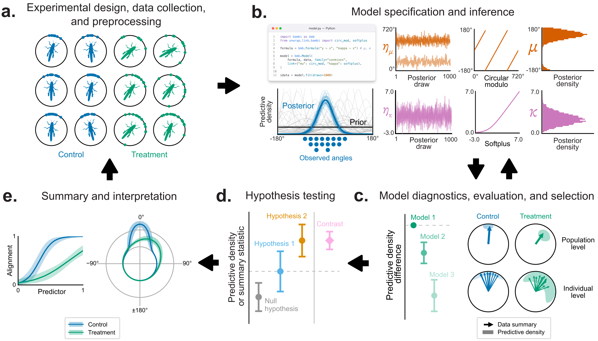

# Unwrap

`unwrap` is a lightweight package for fitting **circular GLMs** (e.g., von Mises models for angles) with **PyMC** and a **Bambi**-style formula interface.

<p align="center">
  
</p>

## Install

```bash
pip install git+https://github.com/jgraving/unwrap
